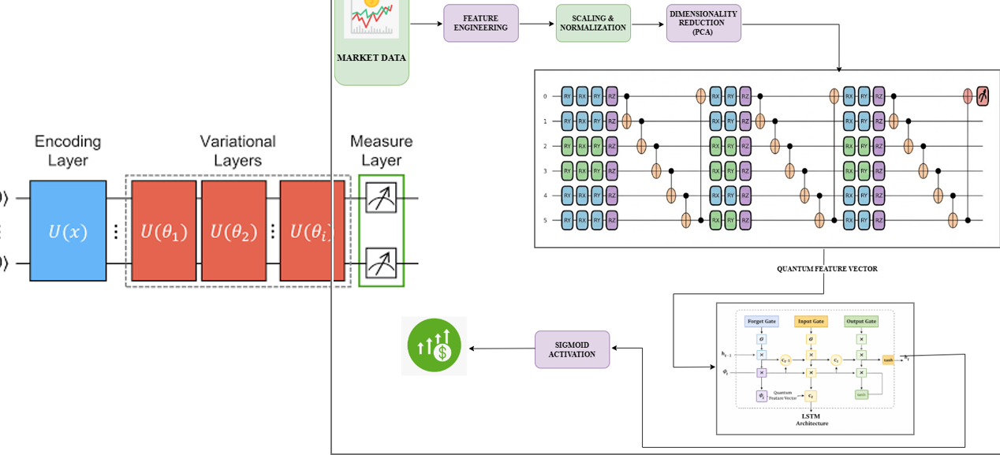
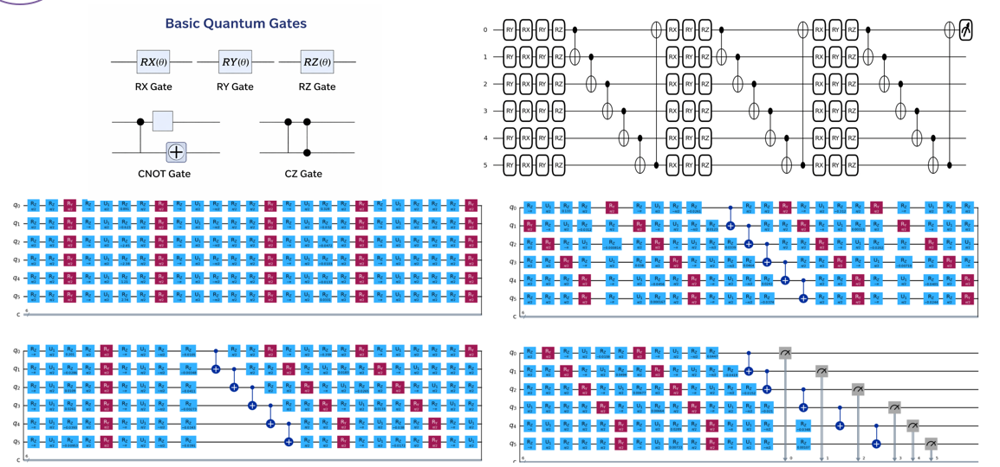
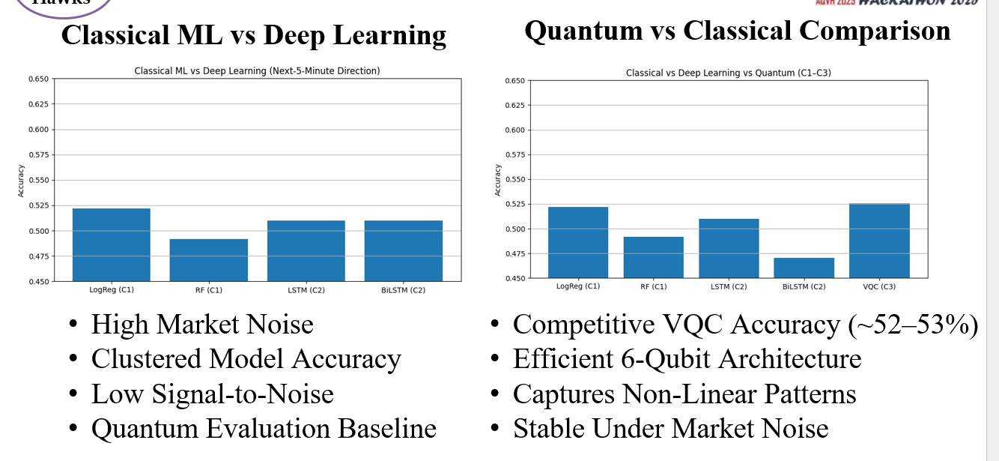
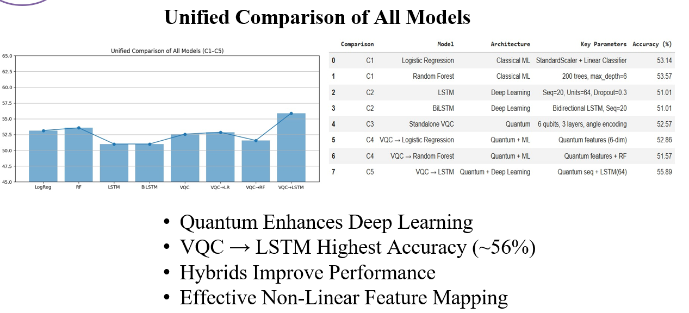
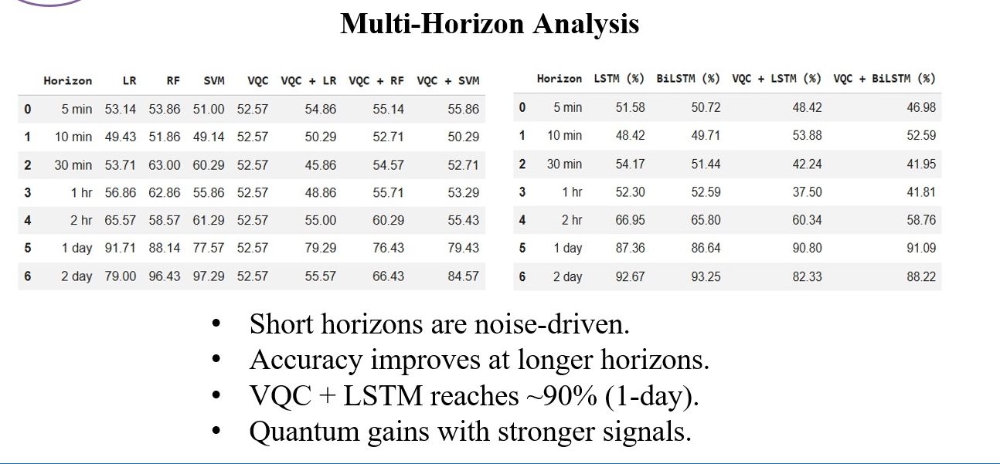
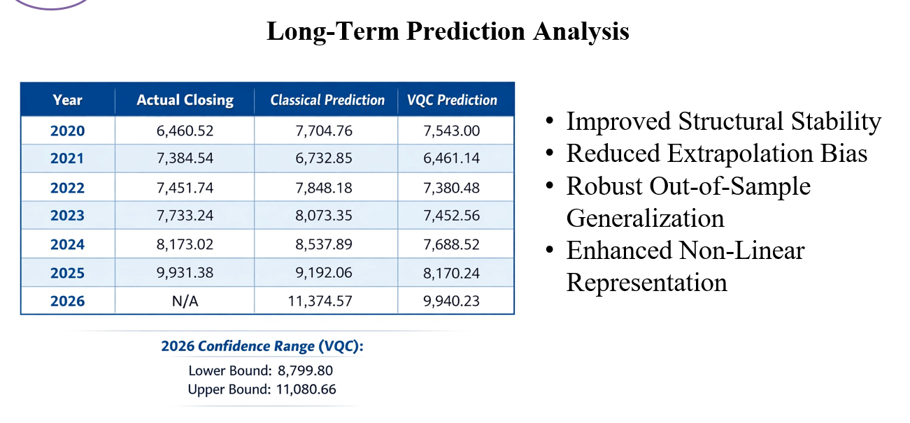
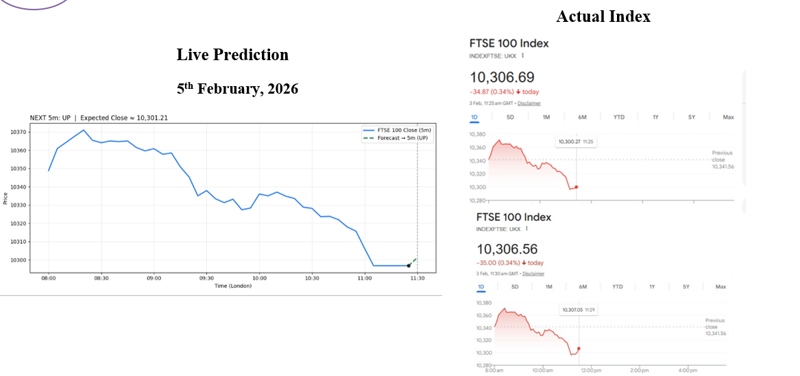
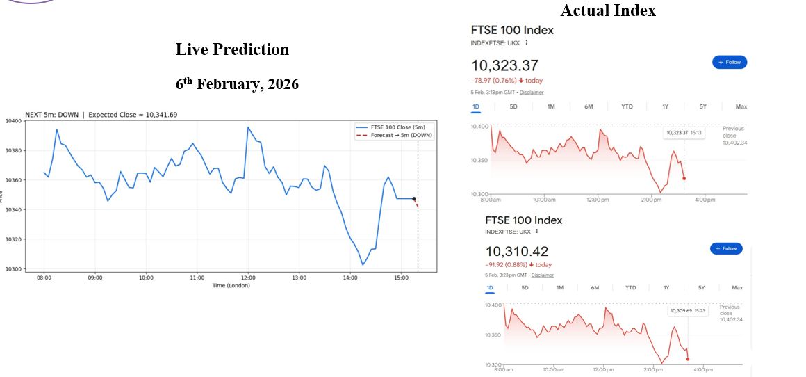
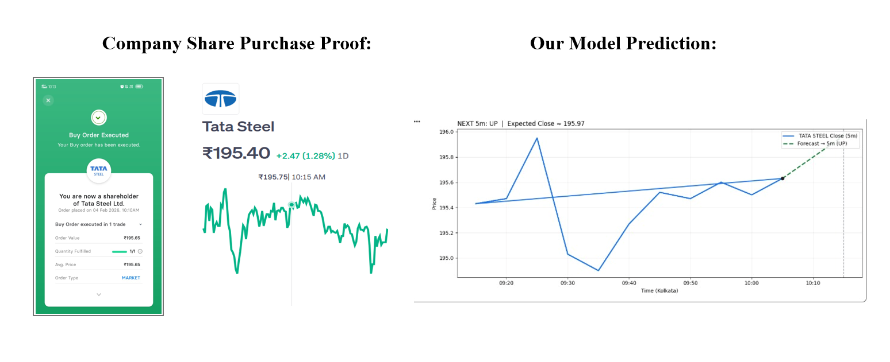

# Hybrid Quantum-Classical Stock Market Prediction (VQC + LSTM)

A hybrid quantum-classical machine learning system that leverages **Variational Quantum Classifiers (VQC)** and **LSTM networks** to predict stock market direction under high volatility and noisy conditions.

---

## Overview
This project explores the use of **quantum machine learning for financial forecasting**, combining classical deep learning with quantum feature representations.

Built during the **Amaravati Quantum Valley Hackathon 2025**, the system is evaluated on multiple financial indices (FTSE 100, BSE, NASDAQ) and demonstrates improved robustness in capturing complex, non-linear market patterns.

The model was also applied in a **real-time investment scenario (Tata Steel)** to evaluate its practical decision-support capability under live market conditions.

The goal is to bridge **research-level quantum techniques** with **real-world financial applications**.

---

## Problem Statement
Stock market prediction remains a challenging task due to:

- High volatility and noise in financial data  
- Complex, non-linear relationships between indicators  
- Poor adaptability of classical models during market regime shifts  
- Trade-off between prediction accuracy and computational efficiency  

Existing systems rely heavily on classical statistical and machine learning approaches, which often struggle to generalize under dynamic market conditions.

This project explores whether quantum-enhanced models can provide more expressive feature representations and improved predictive performance in such environments.

---

## Methodology

The system follows a **hybrid quantum-classical pipeline** to model complex financial market behavior:

- **Market Data Processing:** Historical stock data is collected and transformed through feature engineering, normalization, and dimensionality reduction (PCA).  
- **Quantum Feature Encoding:** Processed features are encoded into a quantum state using parameterized encoding circuits.  
- **Variational Quantum Circuit (VQC):** Multiple variational layers with trainable parameters capture complex, non-linear feature interactions using quantum operations such as rotation gates and entanglement.  
- **Measurement Layer:** The quantum circuit outputs a transformed feature vector representing enriched data patterns.  
- **Temporal Modeling (LSTM):** The quantum feature vector is passed into an LSTM network to capture sequential dependencies in time-series data.  
- **Prediction Layer:** A sigmoid activation layer produces the final market direction prediction.

This hybrid design enables richer feature representation and improved robustness in highly noisy and volatile financial environments.

---

## Quantum Architecture

The quantum component is built using a **Variational Quantum Classifier (VQC)** designed to enhance feature representation:

- **Encoding Layer:** Classical input features are mapped into quantum states using parameterized rotation gates.  
- **Variational Layers:** Multiple trainable layers apply rotation and entanglement operations to capture complex, non-linear feature interactions.  
- **Entanglement Strategy:** Qubits are entangled to model cross-feature dependencies efficiently.  
- **Measurement Layer:** The quantum state is measured to produce a classical feature vector for downstream processing.  

The model was executed using the **PennyLane simulator** and further **transpiled for IBM Quantum hardware (IBM Marrakesh backend)** to ensure compatibility with real-device constraints.

A **6-qubit and 3-layer** architecture is used to balance representational power and computational efficiency, enabling scalable hybrid integration with classical models.

---

## Technology Stack

**Programming & Frameworks**
- Python  
- PyTorch  
- Scikit-learn  

**Quantum Machine Learning**
- PennyLane  
- qBraid Lab

**Data & Processing**
- Pandas  
- NumPy  

**Data Source**
- yFinance API (Yahoo Finance)

**Techniques & Concepts**
- Variational Quantum Classifier (VQC)  
- LSTM (Long Short-Term Memory Networks)  
- Technical Indicators (RSI, Moving Averages, etc.)  
- Dimensionality Reduction (PCA)  
---
## Results & Analysis

### Model Comparison

---

### Unified Model Performance

---

### Multi-Horizon Analysis

---

### Long-Term Prediction Analysis

---
## Live Predictions 

### Day 1

### Day 2

- Predictions are compared against actual market movements  
- Demonstrates model behavior under **live market conditions**  
- Highlights practical use as a **decision-support system** 

This project was evaluated in a **real-time investment scenario using Tata Steel stock data**.

---

## Quantum Advantage

The hybrid quantum-classical design enables enhanced learning through key quantum principles:

- **Superposition** - Represents multiple feature states simultaneously, enabling richer data encoding  
- **Entanglement** - Captures complex cross-feature dependencies that are difficult for classical models  
- **Quantum Feature Mapping** - Transforms classical inputs into a higher-dimensional Hilbert space for improved non-linear representation  
- **Noise Robustness** - Structured quantum encoding helps stabilize learning under highly volatile market conditions  
- **Efficient Representation** - Compact qubit-based encoding allows handling multiple features with reduced dimensional complexity  

These properties contribute to improved modeling of non-linear, noisy financial time-series data.

---

## Use Cases

- **Investment Decision Support** – Assists in identifying potential market trends  
- **Risk Management** – Helps evaluate uncertain and volatile market conditions  
- **Market Timing Strategies** – Supports entry and exit decision-making  
- **Financial Research** – Enables exploration of quantum-enhanced forecasting models 

---

## Novelty & Contributions

- Hybrid **Quantum + Deep Learning (VQC + LSTM)** architecture  
- Application of quantum machine learning to financial forecasting 
- Multi-market evaluation **(FTSE 100, BSE, NASDAQ)**
- Real-world validation using **Tata Steel** stock in a live prediction scenario  
- Real-time predictions at **5-minute intervals** for short-term decision support  
- Quantum circuit transpilation for **IBM Quantum (Marrakesh backend)**  
---
